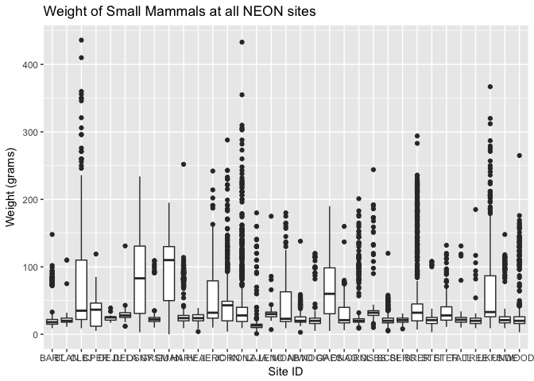
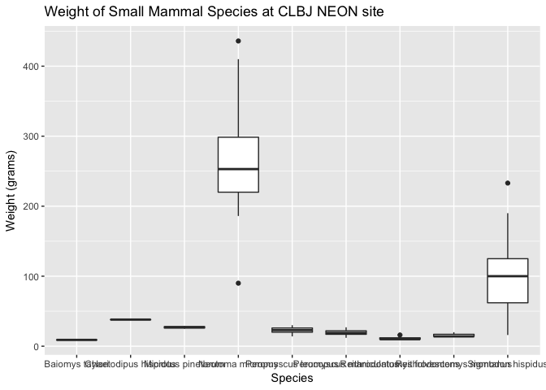
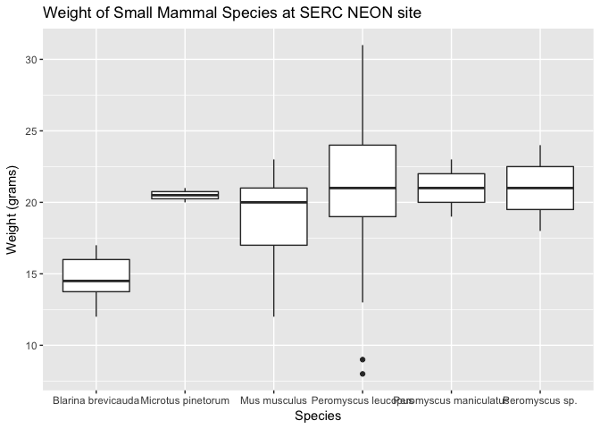
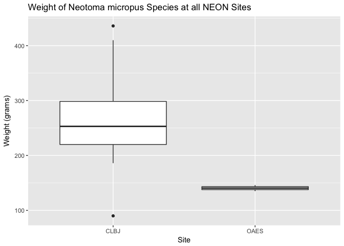
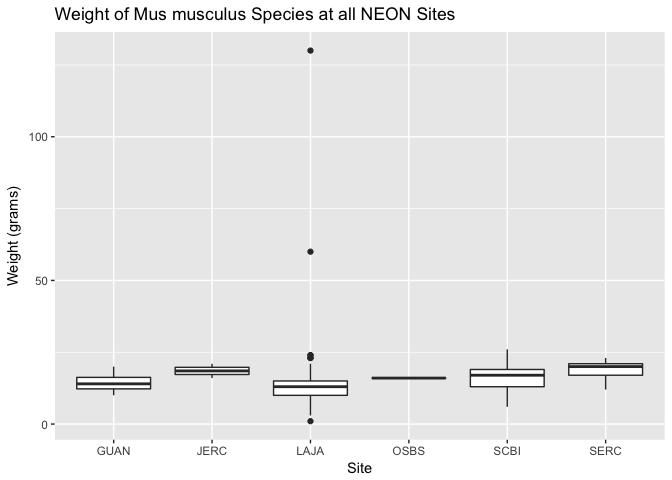

Analysis Report 1: NEON Small Mammal Data
================
Alexia Ford
3/15/2018

Introduction
============

This report is testing how the distribution of weight varies across the National Ecological Observatory Network (NEON) sites using data collected and publically presented by NEON. This report will explain NEON's work/purpose, NEON's design, present the data used, test a hypothesis, and lastly analyze the results. The National Ecological Observatory Network is an ecological observation platform for discovering, understanding, and forecasting the impacts of climate change, land use change, and invasive species on continental-scale ecology with sites distributed within 20 eco-climatic domains across United States, Alaska, Hawaii, and Puerto Rico using remote sensing (Kampe et al. 2010). NEON has allowed for easy accessible data to the public by providing the data the observatory has collected to scientists, land managers, policy makers, educators, and members of the general public interested in addressing these major ecological challenges. The data produced by NEON are strategically aimed at addressing ecological questions, questions that are analyzing complex ecological processes and relationships that govern large scale patterns consistent with the measuring the drivers of change, biogeochemical cycling, and population and community responses across a variety of ecosystems in the ultimate hopes of expanding our understanding of ecological processes and to improve our ability to forecast these ecological changes (Thorpe et al. 2016).

The project is responsible for measuring the causes and effects of environmental change across the United States within these 20 eco-climate domains that all represent different landforms, vegetation, climate, and ecosystem dynamics. The project is constantly collecting data to provide and statistically represent ecological, physical, and biological variability across the US. NEON has four different sites that the observatory collects data from, these sites include: core terrestrial sites, core aquatic sites, relocatable terrestrial sites, and lastly relocatable aquatic sites. The sites are collected using five measurement subsystems of the Observatory including: the Airborne Observation Platform (AOP), Aquatic Instrument System (AIS), Aquatic Observation System (AOS), Terrestrial Instrument System (TIS), and Terrestrial Observation System (TOS) (Thorpe et al. 2016). These five systems of measurement have been used to collect endless data and NEON has continued to do so by properly standardizing protocols across all sites and maintaining community best practices.

This report will be looking at NEON's collection of small mammal data. NEON collects small mammal data by carefully following many protocols and sampling methods. The collection of small mammal field studies has played a vital role in ecology particularly when studying behavioral, population, and community ecology. The use of small mammals is especially helpful as they are easily handled due to trapability and size, as well as readily abundant as they are present in various ecosystems. Small mammals are exceptionally suitable as they are candidate for both short and long-term studies. Short term studies such as examining resource limitation and preditation in population dynamics. Oppsingly, they are also candidates for long-term studies such as small mammal communities responses to extreme climatic events or cycles.

This report will specifically be analyzing the weight of small mammals across all NEON sites, to then take a closer look at the site with the highest average weight and the site with the lowest average weight. The LBJ National Grassland ("CLBJ" site) located in Texas is the site with the highest average weight among small mammals. The Smithsonian Environmental Research Center ("SERC" site) located in Maryland is, opposingly, the site with the lowest average weight among small mammals.

The LBJ National Grassland is a land mass consisting of 16,800 acres of land and is a NEON core terrestrial site located in the Southern Plains of Texas. The site has a rich history used for recreation and hunting, livestock grazing, and fossil fuel extraction. Ecological monitoring is continually performed at the site along with prescribed burning. The climate of this glassland is considered humid subtropical, and the weather typically consists of frequent variations both daily and seasonally besides in the constant hot and humid summers. The average precipitation is 36.8 inches with average summer highs of 94F and average winter lows of 27F. The site has varying dominant tree and grass species, with a particularly clay-rich soil. Lastly, this grasslands wildlife species includes: pronghorn, black-tailed prairie dogs, horned larks, and mountain plovers.

The Smithsonian Environmental Research Center is a relocatable terrestrial NEON site located in Maryland around the Mid-Atlantic coast. This site is surrounded by varying land types including oceanic, grasslands, forests, etc. This site is highly influenced by weather changes dictated greatly by the Atlantic ocean and great lakes. The Smithsonian Environmental Research Center is an important terrestrial ecosystem that includes shrublands that provide crucial habitat for wildlife, and communities such as limestone and dolomite glades that are home to endangered plant species (Rogers and McCarty 2000).

Methods
=======

The data for this report is collected by the National Ecological Observatory Network (NEON). NEON collects small mammal data by carefully following many protocols and sampling methods. NEON's typical target species are nocturnal and cryptic. The common method to sample these target species include: passive, involving kill or live traps, and baited or unbaited. For long-term studies such as small mammal community, population, and disease dynamics mark-rapture methods are commonly used. NEON follows parts of the mark-rapture designs which includes: trap type, bait, marking method, and trap array.

The trap type NEON uses consists of box traps which are live traps that include: Sherman traps, Longworth traps, and Elliott traps that are placed on the ground or in trees and baited. NEON uses H.B. Sherman folding traps in order to facilitate movement of traps among sites. The bait type NEON uses for capture is a seed mixture of millet and sunflower seeds, as it is easy to transport, and less attractive of unwanted visitors than the typical bait, peanut butter. NEON's marking method is ear tagging. The ear tagging is conspicuous and is placed at the base of the ear. Ear tagging can be used to conduct behavioral studies and allows for the recording of the mammal's ear length when tagging. Lastly, NEON's trap array employs 10 X 10 trapping grids, with 10m spacing and 1 trap per station. This design appropriately yields for a sampling area of about 1ha.

Using this small mammal data collected and provided by NEON this report will use R studio to visualize results and test how the distribution of weight varies across NEON sites. To begin, the small mammal NEON data set was read into R studio. From this all the siteID's and small mammal weight's were correlated as a box plot to look at the average small mammal weights of all NEON sites. After viewing the box plot of all the NEON site's average small mammal weights the sites with the highest average small mammal weight and the lowest average small mammal weight were then both analyzed.The site with the highest average weight was the LBJ National Grassland ("CLBJ" site) and the site with the lowest average weight was the Smithsonian Environmental Research Center ("SERC" site).These two sites were explored further using two separate box plots to look at why one site had a particularly high/low average weight and to ask if it was just that one site that caused the average weight to be high/low. This was done by taking the scientific names of the species at these sites against the average weight of the small mammals. Lastly, one of the "CLBJ" site's species and one of the "SERC" site's species were choosen to study further, in order to ask why the "CLBJ" site had a lot of variation in weight from species to species, and opposingly, why the "SERC" site had a much more constant weight across the board with it's varying species. The "CLBJ" species analyzed further was *Neotoma micropus* and *Mus musculus* was analyzed for the "SERC" site. One box plot was made for the weight of *Neotoma micropus*, correlating the species present at all of the NEON sites against weight, and an additional box plot was made for the same purpose just using the species *Mus musculus* instead.

Results
=======

``` r
library("dplyr")
```

    ## 
    ## Attaching package: 'dplyr'

    ## The following objects are masked from 'package:stats':
    ## 
    ##     filter, lag

    ## The following objects are masked from 'package:base':
    ## 
    ##     intersect, setdiff, setequal, union

``` r
library("ggplot2")
library("readr")
```

Read in the small mammal data set:

``` r
# read in the small mammal data from raw data directory
mam_pertrapnight <- read_csv("data/raw_data/mam_pertrapnight.csv")
```

    ## Parsed with column specification:
    ## cols(
    ##   .default = col_character(),
    ##   decimalLatitude = col_double(),
    ##   decimalLongitude = col_double(),
    ##   coordinateUncertainty = col_double(),
    ##   elevation = col_double(),
    ##   elevationUncertainty = col_double(),
    ##   collectDate = col_date(format = ""),
    ##   hindfootLength = col_integer(),
    ##   earLength = col_integer(),
    ##   tailLength = col_integer(),
    ##   weight = col_integer()
    ## )

    ## See spec(...) for full column specifications.

Box plot for the weight of small mammals at all NEON sites:

``` r
# weight of small mammals at all sites in the NEON data
ggplot(mam_pertrapnight, aes(x = siteID,
                             y = weight)) +
  geom_boxplot() +
  ggtitle("Weight of Small Mammals at all NEON sites") +
  xlab("Site ID") +
  ylab("Weight (grams)")
```

    ## Warning: Removed 164713 rows containing non-finite values (stat_boxplot).



Box plot for the weight of small mammals at "CLBJ" NEON site:

``` r
# make a boxplot for the weight of small mammals at "CLBJ" NEON site
mam_pertrapnight %>%
  filter(siteID == "CLBJ") %>%
  filter(!is.na(scientificName)) %>%
  ggplot(aes(x = scientificName,
             y = weight)) +
  geom_boxplot() +
  ggtitle("Weight of Small Mammal Species at CLBJ NEON site") +
  xlab("Species") +
  ylab("Weight (grams)")
```

    ## Warning: Removed 27 rows containing non-finite values (stat_boxplot).



Box plot for the weight of small mammals at "SERC" NEON site:

``` r
# make a boxplot for the weight of small mammals at "SERC" NEON site
mam_pertrapnight %>%
  filter(siteID == "SERC") %>%
  filter(!is.na(scientificName)) %>%
  ggplot(aes(x = scientificName,
             y = weight)) +
  geom_boxplot() +
  ggtitle("Weight of Small Mammal Species at SERC NEON site") +
  xlab("Species") +
  ylab("Weight (grams)")
```

    ## Warning: Removed 31 rows containing non-finite values (stat_boxplot).



Box plot for the weight of *Neotoma micropus* at all NEON sites:

``` r
mam_pertrapnight %>%
  filter(scientificName == "Neotoma micropus") %>%
  ggplot(aes(x = siteID,
             y = weight)) +
  geom_boxplot() +
  ggtitle("Weight of Neotoma micropus Species at all NEON Sites") +
  xlab("Site") +
  ylab("Weight (grams)")
```

    ## Warning: Removed 4 rows containing non-finite values (stat_boxplot).



Box plot for the weight of *Mus musculus* at all NEON sites:

``` r
mam_pertrapnight %>%
  filter(scientificName == "Mus musculus") %>%
  ggplot(aes(x = siteID,
             y = weight)) +
  geom_boxplot() +
  ggtitle("Weight of Mus musculus Species at all NEON Sites") +
  xlab("Site") +
  ylab("Weight (grams)")
```

    ## Warning: Removed 27 rows containing non-finite values (stat_boxplot).



Discussion
==========

The first box plot showcases the weight of small mammals at all NEON sites. The average weight is showcased on a scale from 0 to 450 grams. The average weight for each site varies as some sites display no small mammal weight above 50 grams such as the "SERC" and "HEAL" sites while other sites visibly surpass an average weight of 400 grams such as the "CLBJ" site and "KONZ" site.

The second box plot models the highest average small mammal weight by looking at the weight of small mammal species at the "CLBJ" LBJ National Grassland NEON site. This site displays the weight of 9 different species with varying weights. The two species that had noticeably high weights were *Neotoma micropus* and *Sigmodon hispidus*, both these species weights were above 100 grams while the other 7 species weights were not as variable and under 50 grams. *Sigmodon hispidus* is a hispid cotton rat while *Neotoma micropus* is a southern plains wood rat. Both these species are rather common in the Southern Plains of Texas. It has been studied that these two species of rats are common in the Southern Plains of Texas when abundance of grass cover was deeper and that the common denominator of cotton rat habitat was tall, dense grass with various forbs and shrubs (Green and Wilkins 2014). Species that were less variable and found to be under 50 grams like the *Chaetodipus hispidus* pocket mice, for example, are typically common in areas of intermediate cover, in places like Arizona, as they are seen increased in areas of grazed plot and seen declined in areas of ungrazed plot since they are much smaller rats and ungrazed plots are dominated by taller species (Jones et al. 2003). It is also known that the "CBLJ" site undergoes prescribed burning and is safe to conclude that larger animals would be more abundant as they would have a better chance of escaping any fires, while smaller animals would not.

The third box plot models the lowest average small mammal weight by looking at the weight of small mammal species at the "SERC" Smithsonian Environmental Research Center NEON site. Unlike the "CLBJ" site there are only 6 visible species weights at this site and all 6 species have relatively constant weights. The average weight is understandably constant as 3 out of the 6 genus names for the species are Peromyscus, meaning, deer mice and the other species are also classified as small rodents or small mice therefore all 6 species have somewhat similar weights. The weight scale for the box plot is from 0 to 30 grams, with no outliers for any of the species with the exception of 2 single outliers seen for the species *Peromyscus leucopus*. Noted outliers for *Peromyscus leucopus* is not surprisingly as this species can be typically hard to properly record and classify. *Peromyscus leucopus* has been known to be quite subjective to identify and typically have no morphological characteristic by itself to reliably identify this species 100% of the time (Feldhamer et al. 1983). The difficulty of identifying a species can therefore result in outliers, and inaccurate results.

Box plot number four took a closer look at the species *Neotoma micropus* (southern plains wood rat) found at the "CLBJ" LBJ National Grassland site. This box plot ranges in weight from 0 to 400 grams. It displays only two sites with recorded weights for the species *Neotoma micropus*, the "CLBJ" site and the "OAES" site. The "OAES" site shows very little abundance of *Neotoma micropus* at around 150 grams, while there is a quite large abundance of *Neotoma micropus* at the "CLBJ" site. The "OAES" site greatly differs from the "CLBJ" Texas grassland site as it is a southern plain in Oklahoma at the Klemme Range Research Station. It is found from trapping data that *Neotoma micropus* female home ranges were similar to the area of cactus patches (Conditt and Ribble 1997) and Texas would house cactus patches more commonly so than Oklahoma. Although, the "OAES" site shows very little abundance of *Neotoma micropus* while there is a quite large abundance of the species at the "CLBJ" site both sites do have similarities in habitat such as interaction of fire and grazing, livestock production, and tall grasses, therefore the visibility of the species in both places is applicable even though it is more visible at the "CLBJ" site than the "OAES" site (Limb et al. 2011). Prescribed burning of these particular sites also could greatly affect habitat as prescribed burning causes short-term declines in shrub cover and immediate decline of woody debris affecting shelter and small mamamal abundance (Converse et al. 2006).

Lastly, a fifth box plot took a closer look at the species *Mus musculus* found at the "SERC" Smithsonian Environmental Research Center NEON site. This box plot weight range is much smaller than the weight range of *Neotoma micropus* ranging from 0 to 200 grams, and displays a total of six sites. The weight of *Mus musculus* for each of the sites is relatively constant, none of the sites pass 25 grams besides a couple outliers for the "LAJA" site. *Mus musculus* is a well-known house mice seen abundantly and consistently in all populations as seen in the box plot. These house mice form stable demes over a period of time in spite of factors such as high animal density in some territories and there is a number stable demes of *Mus musculus* in natural populations (Reimer and Petras 1967).

Sources Cited
=============

Conditt, S. A., and D. O. Ribble. 1997. Social organization of neotoma micropus, the southern plains woodrat. American Midland Naturalist:290–297.

Converse, S. J., W. M. Block, and G. C. White. 2006. Small mammal population and habitat responses to forest thinning and prescribed fire. Forest ecology and management 228:263–273.

Feldhamer, G. A., J. E. Gates, and J. H. Howard. 1983. Field identification of peromyscus maniculatus and p. leucopus in maryland: Reliability of morphological characteristics. Acta Theriologica 28:417–423.

Green, N. S., and K. T. Wilkins. 2014. Habitat associations of the rodent community in a grand prairie preserve. The Southwestern Naturalist 59:349–355.

Jones, Z. F., C. E. Bock, and J. H. Bock. 2003. Rodent communities in a grazed and ungrazed arizona grassland, and a model of habitat relationships among rodents in southwestern grass/shrublands. The American midland naturalist 149:384–394.

Kampe, T. U., B. R. Johnson, M. A. Kuester, and M. Keller. 2010. NEON: The first continental-scale ecological observatory with airborne remote sensing of vegetation canopy biochemistry and structure. Journal of Applied Remote Sensing 4:043510.

Limb, R. F., S. D. Fuhlendorf, D. M. Engle, J. R. Weir, R. D. Elmore, and T. G. Bidwell. 2011. Pyric–herbivory and cattle performance in grassland ecosystems. Rangeland Ecology & Management 64:659–663.

Reimer, J., and M. Petras. 1967. Breeding structure of the house mouse, mus musculus, in a population cage. Journal of Mammalogy 48:88–99.

Rogers, C. E., and J. P. McCarty. 2000. Climate change and ecosystems of the mid-atlantic region. Climate Research 14:235–244.

Thorpe, A. S., D. T. Barnett, S. C. Elmendorf, E.-L. S. Hinckley, D. Hoekman, K. D. Jones, K. E. LeVan, C. L. Meier, L. F. Stanish, and K. M. Thibault. 2016. Introduction to the sampling designs of the national ecological observatory network terrestrial observation system. Ecosphere 7.
